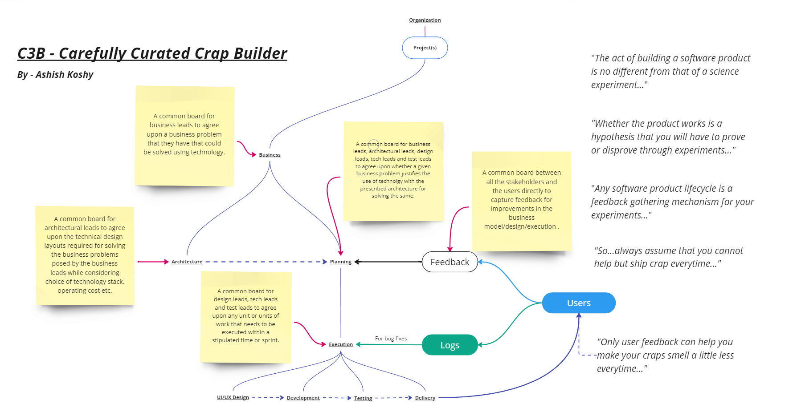

C3B as a conceptual framework sets a realistic and user-focused tone for software development process.
It assumes that perfection is a journey rather than a destination. It is an antithesis to the traditional 
waterfall method. 
(The pros and cons of this approach are listed below) 
#

#

# PROS & CONS:
## PROS:

### Embracing Imperfection: 
Software development is an iterative process, where initial imperfections are expected. 
This mindset can encourage a culture of continuous improvement and innovation.

### Experimentation and Validation: 
C3B embraces the scientific method, stressing that hypothesis validation through experimentation 
is key to product evolution.

### Feedback Loop: 
C3B places significant importance on feedback at various stages to cater to a user-centric development approach. 
This is a strong conceptual foundation as it underlines the importance of real-world use and user satisfaction 
in shaping the product. The user's experience and feedback are central to the development process.

### Common Boards: 
The use of common boards across different domains (Business, Architecture, etc.) follows an integrated 
approach where cross-functional teams collaborate closely, sharing insights and decisions.

### Agility and Responsiveness: 
C3B doubles down on agile methodology, where the product is developed, tested, and improved 
in cycles, adapting to new information and changing requirements.

### Candid Communication: 
C3B attempts to promote a candid and open organizational culture that isn't afraid to recognize 
and address shortcomings in the product.

### Logs for Bug Fixes: 
Using logs specifically for bug fixes follows a proactive approach to quality assurance, 
where monitoring and logs drive the maintenance phase of the software lifecycle.

#
## CONS:
While being user-centric and iterative, this approach has some conceptual shortcomings that could be addressed:

### Optimism Bias in Feedback: 
Relying heavily on user feedback assumes users can articulate their needs and that their feedback will always 
lead to product improvement. However, users may not always know what they want or need, and feedback could be 
skewed by a vocal minority.

### Quality of Crap: 
Accepting too many imperfections might downplay the importance of striving for high-quality outputs from the start. 
There's a fine balance between accepting imperfections and compromising on quality.

### Iteration Without Direction: 
Iteration is beneficial, but without a clear direction or end goal, it can lead to a cycle of endless revisions 
that don't necessarily improve the product in a meaningful way.

### Feature Creep: 
An open-ended feedback loop could lead to continuously adding features to address every piece of feedback, 
which can bloat the product and deviate from the core value proposition.

### Log Overload: 
Logs are useful, but without proper tools and processes to analyze them, they can become overwhelming and 
lead to analysis paralysis.

### Feedback Fatigue: 
Constantly asking users for feedback can lead to feedback fatigue, where users become less willing to 
provide insights over time.

### Misalignment With Business Goals: 
C3B focuses heavily on user feedback without clear alignment to business goals and strategy. 
This could potentially lead to a product that users like but is not commercially viable.

### Resource Intensity: 
C3B as an iterative, feedback-driven approach can be resource-intensive, requiring significant time and 
effort to analyze feedback and logs and then implement changes.

### Scalability Issues: 
As the product grows, C3B may not scale efficiently. The mechanisms that work for a startup may 
not be suitable for a large enterprise with thousands of users and multiple product lines.

### Neglect of Proactivity: 
By focusing on reactive feedback and fixes, there may be a lack of proactive innovation or anticipation 
of future trends and user needs.

### Data Privacy: 
C3B does not explicitly take data privacy and security into consideration, which are critical when dealing with 
user data and logs.

To address these shortcomings, one could incorporate a more balanced scorecard approach that weighs user feedback 
against other key performance indicators, including business viability, technical feasibility, and user satisfaction. 
It’s also important to have robust analytics to process feedback and logs, clear product vision and roadmaps, 
and an emphasis on proactive innovation alongside reactive iterations.
